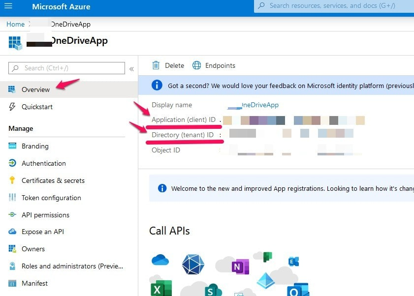
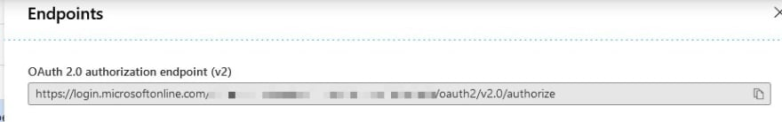
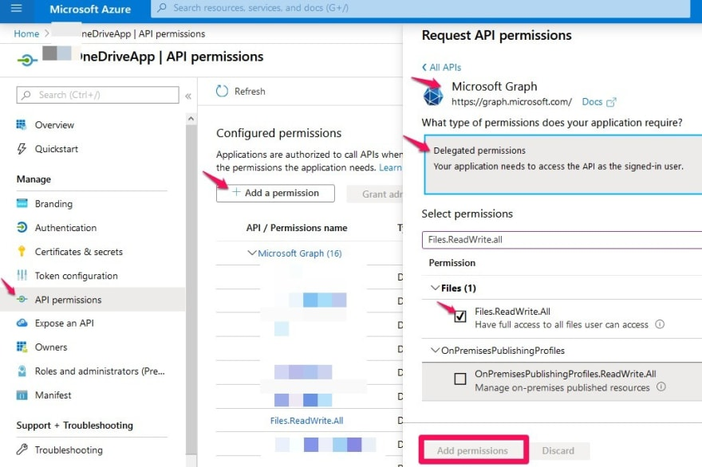
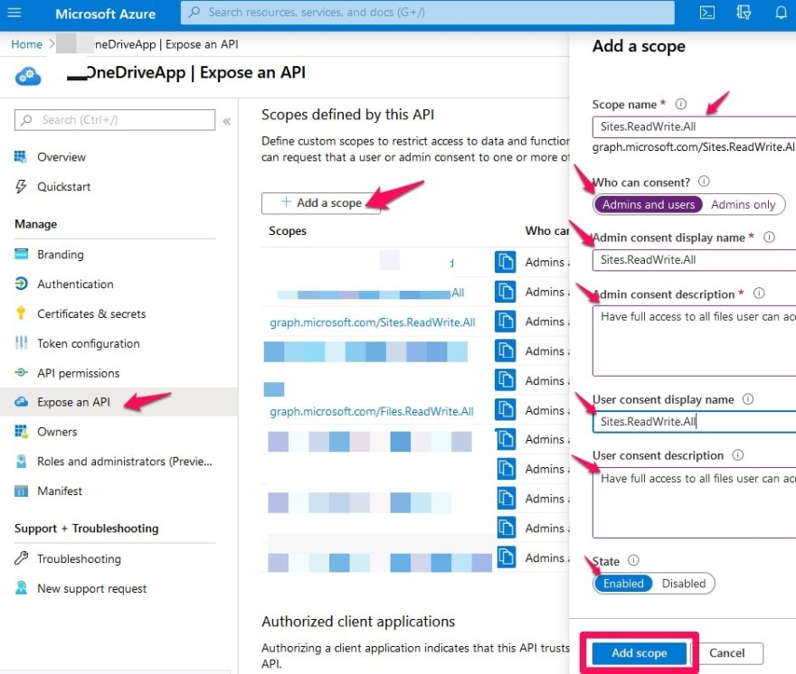
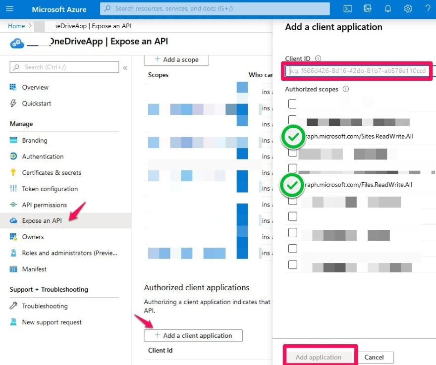
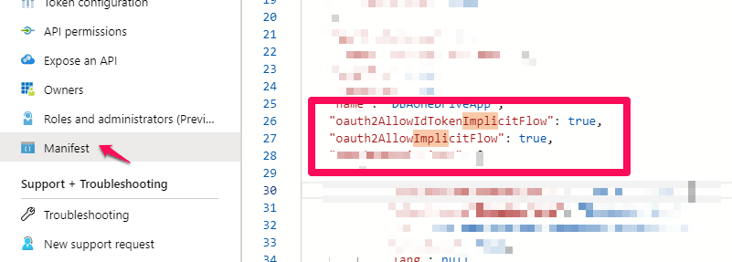
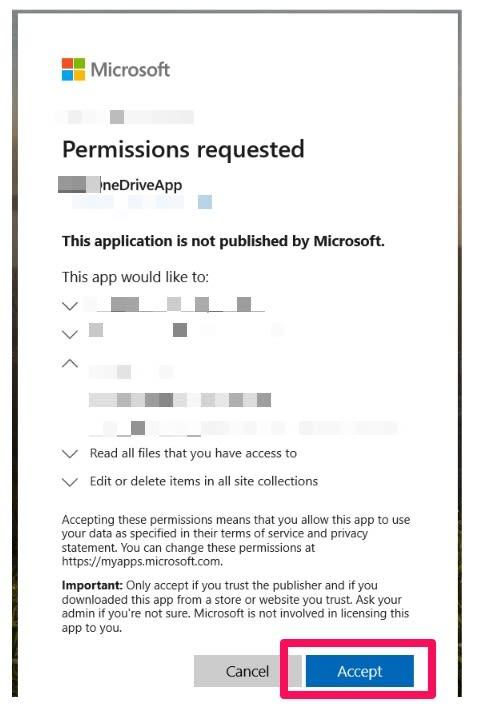

## There are two major parts to this tutorial:

1. Create, set up and configure the API on Azure Portal
2. Download and install Rclone on your operating system
3. Getting a token from Microsoft which you need to do in your browser. rclone config walks you through it.
4. Test and upload a test file or folder

## Part 1 - Create, set up and configure the API on Azure Portal

### Step 1: Register your application on Azure


    • Go to https://portal.azure.com/#home
    • Azure Active Directory -> App Registration -> New Registration:

    • Name your API
    • Accounts in any organizational directory (Any Azure AD directory - Multitenant) and personal Microsoft accounts
    • Select Web in Redirect URI, then type (do not copy and paste) http://localhost:53682/ and click Register. 
    • Click register
    • Once your new API is created, click on the API and Save the following two information for the code later:
      
    • Application (client) ID
    • Directory (tenant) ID



## Then grab the OAuth 2.0 authorization endpoint (v2):


## 

## Step 2: Configure the API permissions:

``` 
API permissions → Add a permission → Microsoft APIs → Microsoft Graph → Delegated permissions → Select permissions Permissions needed “Files.Read, Files.ReadWrite, Files.Read.All, Files.ReadWrite.All, offline_access, User.Read and Sites.Read.All 
```
##



##

## Step 3: Expose the API

### After adding the permissions in Step 3, we have to expose the API and those permissions to the scope:



### Then we need to add the client ID and select the authorized scopes we just added.

```
Expose an API → Add a client application → Enter Client ID → select the Authorized scopes → click add application
```



## Step 4: Edit the manifest (Very important to allow Implicit grant):

### This is a very important step in the API set. Go to Manifest and set the Oauth2IdToken and ImplicitFlow to true:

## 



##
##

## Part 2 - Download and install Rclone on your operating system:

* [Rclone Official WebSite](https://rclone.org/downloads/) 

Script download and install To install rclone on Linux/macOS/BSD systems, run:

```
curl https://rclone.org/install.sh | sudo bash
```

## Part 3 - Getting a token from Microsoft which you need to do in your browser. rclone config walks you through it:

## Run:

```
 rclone config
```

## This will guide you through an interactive setup process:

```
e) Edit existing remote
n) New remote
d) Delete remote
r) Rename remote
c) Copy remote
s) Set configuration password
q) Quit config
e/n/d/r/c/s/q> n
name> remote
Type of storage to configure.
Enter a string value. Press Enter for the default ("").
Choose a number from below, or type in your own value
[snip]
XX / Microsoft OneDrive
   \ "onedrive"
[snip]
Storage> onedrive
Microsoft App Client Id
Leave blank normally.
Enter a string value. Press Enter for the default ("").
client_id>
Microsoft App Client Secret
Leave blank normally.
Enter a string value. Press Enter for the default ("").
client_secret>
Edit advanced config? (y/n)
y) Yes
n) No
y/n> n
Remote config
Use auto config?
 * Say Y if not sure
 * Say N if you are working on a remote or headless machine
y) Yes
n) No
y/n> y
If your browser doesn't open automatically go to the following link: http://127.0.0.1:53682/auth
Log in and authorize rclone for access
Waiting for code...
Got code
Choose a number from below, or type in an existing value
 1 / OneDrive Personal or Business
   \ "onedrive"
 2 / Sharepoint site
   \ "sharepoint"
 3 / Type in driveID
   \ "driveid"
 4 / Type in SiteID
   \ "siteid"
 5 / Search a Sharepoint site
   \ "search"
Your choice> 1
Found 1 drives, please select the one you want to use:
0: OneDrive (business) id=b!Eqwertyuiopasdfghjklzxcvbnm-7mnbvcxzlkjhgfdsapoiuytrewqk
Chose drive to use:> 0
Found drive 'root' of type 'business', URL: https://org-my.sharepoint.com/personal/you/Documents
Is that okay?
y) Yes
n) No
y/n> y
--------------------
[remote]
type = onedrive
token = {"access_token":"youraccesstoken","token_type":"Bearer","refresh_token":"yourrefreshtoken","expiry":"2018-08-26T22:39:52.486512262+08:00"}
drive_id = b!Eqwertyuiopasdfghjklzxcvbnm-7mnbvcxzlkjhgfdsapoiuytrewqk
drive_type = business
--------------------
y) Yes this is OK
e) Edit this remote
d) Delete this remote
y/e/d> y
```

### Open the link in your web browser and click to accept to accept the permissions requested:




**_NOTE:_**  That rclone runs a webserver on your local machine to collect the token as returned from Microsoft. This only runs from the moment it opens your browser to the moment you get back the verification code. This is on http://127.0.0.1:53682/ and this it may require you to unblock it temporarily if you are running a host firewall.

**_NOTE:_**  Official Documetation https://rclone.org/onedrive/

## Part 3 - Test and upload a test file or folder:

```
rclone copy /path/to/folder remote:/path
```